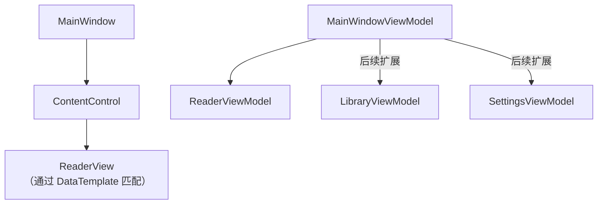
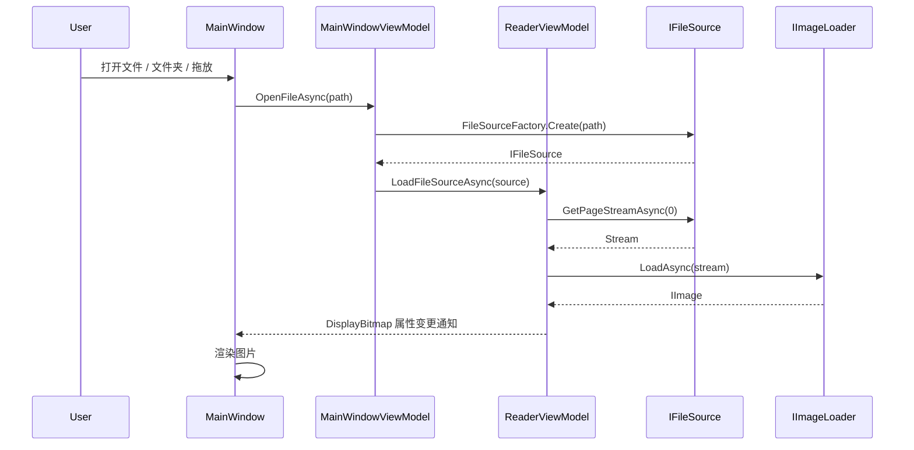

# NbReader 架构设计

## 1. 解决方案结构

```
nbreader/
├── NbReader.sln
├── Directory.Build.props          # 统一版本号 (v0.1.0)
├── .gitignore
├── AGENTS.md
├── docs/                          # 设计文档
│   ├── long-term-plan.md
│   ├── short-term-plan.md         # 当前短期计划（Phase 1 收尾 → Phase 2）
│   ├── test-checklist.md          # 当前阶段测试清单
│   ├── test-checklist-full.md     # 全量回归测试清单
│   ├── test-checklist-archive-phase0-1.md   # 已归档（Phase 0→1 测试清单）
│   ├── short-term-plan-archive-phase0-1.md  # 已归档（Phase 0→1 短期计划）
│   └── architecture.md
├── src/
│   ├── NbReader/                  # Avalonia 主项目（UI 层）
│   │   ├── NbReader.csproj
│   │   ├── App.axaml / App.axaml.cs
│   │   ├── Program.cs
│   │   ├── ViewLocator.cs
│   │   ├── Views/                  # 视图（AXAML + code-behind）
│   │   │   ├── MainWindow.axaml / .axaml.cs
│   │   │   └── ReaderView.axaml / .axaml.cs  ✅
│   │   ├── ViewModels/             # 视图模型
│   │   │   ├── ViewModelBase.cs
│   │   │   ├── MainWindowViewModel.cs
│   │   │   └── ReaderViewModel.cs
│   │   ├── Converters/             # 值转换器 ✅
│   │   │   └── ImageConverter.cs   # IImage → Avalonia Bitmap
│   │   ├── Services/               # UI 层服务
│   │   ├── Models/                 # UI 层模型
│   │   └── Assets/                 # 静态资源
│   │       └── avalonia-logo.ico
│   │
│   ├── NbReader.Core/              # 核心逻辑库（无 UI 依赖）
│   │   ├── NbReader.Core.csproj
│   │   ├── Abstractions/           # 接口定义 ✅
│   │   │   ├── IFileSource.cs
│   │   │   ├── IImageLoader.cs
│   │   │   └── IArchiveService.cs
│   │   ├── Models/                 # 领域模型 ✅
│   │   │   ├── ComicInfo.cs
│   │   │   ├── PageInfo.cs
│   │   │   └── ReadingProgress.cs
│   │   ├── Services/               # 核心服务实现 ✅
│   │   │   ├── SkiaImage.cs        ✅ IImage 实现
│   │   │   ├── SkiaImageLoader.cs  ✅ IImageLoader 实现
│   │   │   ├── DirectoryFileSource.cs  ✅ 图片文件夹文件源
│   │   │   ├── CbzFileSource.cs        ✅ CBZ 压缩包文件源
│   │   │   ├── CbrFileSource.cs        ✅ CBR 压缩包文件源
│   │   │   └── FileSourceFactory.cs    ✅ 文件源工厂
│   │   └── Extensions/             # 扩展方法（待实现）
│   │
│   └── NbReader.Tests/             # 测试项目
│       ├── NbReader.Tests.csproj
│       ├── Core/                   # 核心逻辑测试
│       │   ├── SkiaImageLoaderTests.cs       ✅ 6 个用例
│       │   ├── ImageConverterTests.cs        ✅ 4 个用例
│       │   ├── DirectoryFileSourceTests.cs   ✅ 12 个用例
│       │   ├── CbzFileSourceTests.cs         ✅ 12 个用例
│       │   ├── CbrFileSourceTests.cs         ✅ 6 个用例
│       │   └── FileSourceFactoryTests.cs     ✅ 8 个用例
│       └── UI/                     # UI 逻辑测试
│           └── ReaderViewModelTests.cs       ✅ 17 个用例
```

---

## 2. 分层架构

```
┌──────────────────────────────────────────┐
│              UI Layer (NbReader)         │
│  Avalonia Views + ViewModels + Converters │
├──────────────────────────────────────────┤
│          Core Layer (NbReader.Core)      │
│     Models + Services + Abstractions     │
├──────────────────────────────────────────┤
│          Infrastructure (NuGet)          │
│  Avalonia, SharpCompress, SkiaSharp, ... │
└──────────────────────────────────────────┘
```

**依赖规则：**
- `NbReader` → `NbReader.Core` ✓
- `NbReader.Core` → `NbReader` ✗（核心库不依赖 UI）
- `NbReader.Tests` → `NbReader.Core` + `NbReader` ✓

---

## 3. 核心接口设计

### 3.1 `IFileSource` — 文件源

```csharp
namespace NbReader.Core.Abstractions;

/// <summary>
/// 漫画文件源：抽象本地文件、压缩包、在线源等。
/// </summary>
public interface IFileSource
{
    /// <summary>源名称（用于显示）</summary>
    string Name { get; }

    /// <summary>总页数</summary>
    int PageCount { get; }

    /// <summary>获取指定页的图片流</summary>
    Task<Stream> GetPageStreamAsync(int pageIndex);

    /// <summary>获取指定页的缩略图流（可选，用于预览）</summary>
    Task<Stream?> GetThumbnailStreamAsync(int pageIndex);

    /// <summary>释放资源</summary>
    void Dispose();
}
```

### 3.2 `IImageLoader` — 图片加载器

```csharp
namespace NbReader.Core.Abstractions;

/// <summary>
/// 图片加载器：将流解码为可渲染的位图对象。
/// </summary>
public interface IImageLoader
{
    /// <summary>从流加载图片</summary>
    Task<IImage> LoadAsync(Stream stream);

    /// <summary>从文件加载图片</summary>
    Task<IImage> LoadAsync(string filePath);
}

/// <summary>
/// 跨平台位图抽象（解耦具体图片库）。
/// </summary>
public interface IImage : IDisposable
{
    int Width { get; }
    int Height { get; }
    object NativeImage { get; }  // 平台相关位图对象
}
```

### 3.3 `IArchiveService` — 压缩包服务

```csharp
namespace NbReader.Core.Abstractions;

/// <summary>
/// 压缩包服务：处理 ZIP/RAR 等格式的解压。
/// </summary>
public interface IArchiveService
{
    /// <summary>支持的扩展名</summary>
    IReadOnlySet<string> SupportedExtensions { get; }

    /// <summary>判断是否支持该文件</summary>
    bool CanOpen(string filePath);

    /// <summary>列出所有条目</summary>
    Task<IReadOnlyList<ArchiveEntry>> ListEntriesAsync(string filePath);

    /// <summary>提取指定条目</summary>
    Task<Stream> ExtractEntryAsync(string filePath, string entryName);
}

public record ArchiveEntry(string Name, long Size, bool IsDirectory);
```

---

## 4. MVVM 导航设计



**导航方式：** 使用 `ContentControl` + `DataTemplate` 按 VM 类型自动匹配视图，由 `MainWindowViewModel.CurrentView` 属性控制切换。

```csharp
public partial class MainWindowViewModel : ViewModelBase
{
    [ObservableProperty]
    private ViewModelBase _currentView;

    public ReaderViewModel Reader { get; }

    public MainWindowViewModel(ReaderViewModel reader)
    {
        Reader = reader;
        CurrentView = reader;
    }
}
```

---

## 5. 数据流



---

## 6. 关键技术选型

| 组件 | 选型 | 版本 | 理由 |
|------|------|------|------|
| .NET SDK | .NET 8 | 8.0.420 | LTS 长期支持 |
| UI 框架 | Avalonia UI | 11.2.5 | 跨平台，XAML 风格，成熟 |
| MVVM | CommunityToolkit.Mvvm | 8.4.1 | 官方推荐，源生成器减少样板代码 |
| DI 容器 | Microsoft.Extensions.DependencyInjection | 8.0.1 | .NET 标准，轻量 |
| 图片渲染 | SkiaSharp | 3.116.1 | 高性能 2D 渲染，WebP 支持好 |
| 压缩处理 | SharpCompress | 0.39.0 | 支持 ZIP / RAR / 7Z |
| 测试 | xUnit + FluentAssertions | 2.9.2 / 7.0.0 | 社区标准 |
| 日志 | Microsoft.Extensions.Logging | 8.0.1 | .NET 标准 |

---

## 7. 设计原则（SOLID）

| 原则 | 实践 |
|------|------|
| **S** 单一职责 | 每个类只做一件事（读文件、渲染图片、管理状态分离） |
| **O** 开闭原则 | 通过 `IFileSource` 接口扩展新格式，无需修改现有代码 |
| **L** 里氏替换 | 所有 `IFileSource` 实现可互相替换 |
| **I** 接口隔离 | 小而专注的接口（`IFileSource` ≠ `IImageLoader`） |
| **D** 依赖反转 | 核心库定义接口，UI 层通过 DI 注入实现 |

---

## 8. 协程与线程模型

- **UI 线程：** 所有 Avalonia 属性绑定和 UI 更新
- **后台线程：** 文件 I/O、图片解码、压缩包解压
- **线程安全：** `ViewModelBase` 内置 `Dispatcher.UIThread` 调度

---

## 9. 事件路由架构

为避免 Avalonia 控件树中事件被 ScrollViewer 等子控件拦截，采用 **Window 层 Tunnel（隧道）优先拦截** 策略：

| 交互 | 处理层 | 策略 | 机制 |
|------|--------|------|------|
| 键盘翻页/缩放 | MainWindow | Tunnel KeyDown | `AddHandler(KeyDownEvent, ..., Tunnel, true)` 直接调 VM 命令 |
| F11 全屏切换 | MainWindow | Tunnel KeyDown | 同上，切换 `WindowState` |
| Ctrl+滚轮缩放 | MainWindow | Tunnel PointerWheel | 拦截 Ctrl 组合 → 改 `VM.ZoomLevel` → ReaderView 监听 → `ApplyZoom()` |
| 普通滚轮滚动 | ScrollViewer | 原生（不拦截） | ReaderView 不重写 `OnPointerWheelChanged` |
| 中键拖拽平移 | ScrollViewer | Tunnel Pointer | `AddHandler` 直接挂 ScrollViewer 上 + `Pointer.Capture` |
| 拖放文件 | MainWindow | Bubble | `AddHandler(DragDrop.DropEvent, OnDrop)` |

**关键原则：** 缩放由 VM 驱动（`ZoomLevel` 属性），View 被动响应。ScrollViewer 原生行为不被干扰。

```csharp
// ViewModel 中启动后台任务更新属性
public async Task LoadPageAsync(int index)
{
    IsLoading = true;
    var stream = await Task.Run(() => _fileSource.GetPageStreamAsync(index));
    var image = await Task.Run(() => _imageLoader.LoadAsync(stream));
    CurrentImage = image; // 在 UI 线程设置（由源生成器处理）
    IsLoading = false;
}
```
